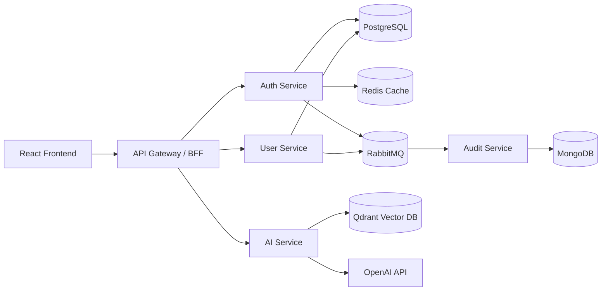
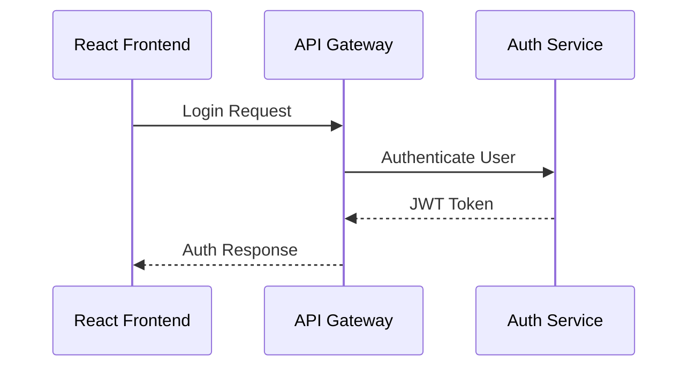
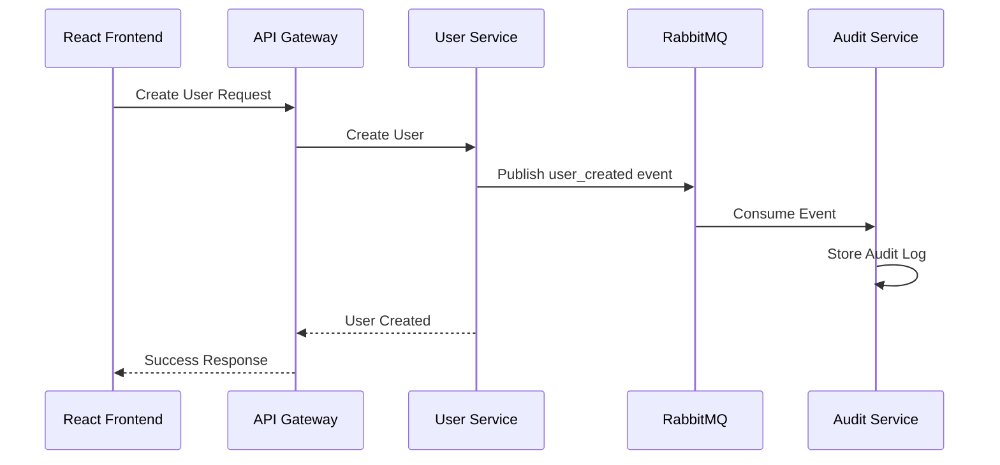
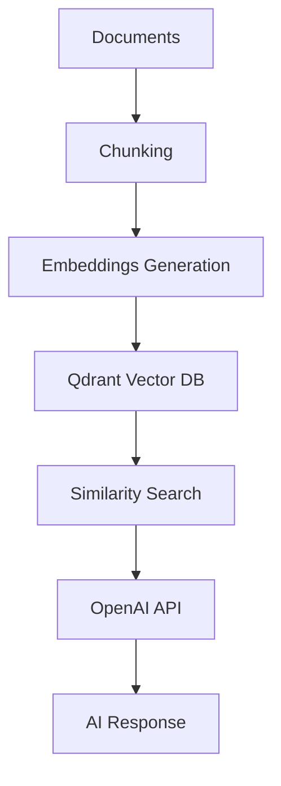

# Architecture Overview

## Introduction

This project implements a microservices-based User Management Platform designed with scalability, maintainability, and extensibility in mind. The platform supports:

- Authentication and authorization
- User management
- Audit logging
- Role-based access control
- AI-powered contextual assistant using RAG (Retrieval-Augmented Generation)

The system is designed to run locally using Docker Compose and follows modern software engineering principles including:

- Domain-Driven Design (DDD)
- Clean Architecture
- Microservices architecture
- Event-driven communication
- Containerized infrastructure

---

# High-Level Architecture



---

# Microservices Overview

## API Gateway / BFF

The API Gateway acts as the single entry point for the frontend application.

### Responsibilities

- Request routing
- JWT validation
- Response aggregation
- API abstraction for frontend clients
- Centralized error handling

### Why?

Using an API Gateway simplifies frontend integration and decouples clients from internal microservice topology.

---

## Auth Service

Responsible for authentication and authorization.

### Responsibilities

- User registration
- User login
- JWT generation and validation
- Role validation
- Token refresh logic

### Database

- PostgreSQL
- Redis (caching/session support)

### Why PostgreSQL?

Authentication and authorization data are highly relational and transactional in nature, making PostgreSQL a strong fit for consistency and reliability.

### Why Redis?

Redis improves performance for token/session caching and reduces repeated database access.

---

## User Service

Responsible for user profile and account management.

### Responsibilities

- CRUD operations for users
- Profile management
- User lookup/search

### Database

- PostgreSQL

### Why?

User entities require transactional consistency and relational integrity.

---

## Audit Service

Responsible for audit logging and traceability.

### Responsibilities

- Access logging
- Audit trail persistence
- Security event tracking
- Event consumption from RabbitMQ

### Database

- MongoDB

### Why MongoDB?

Audit events are append-only and semi-structured. MongoDB provides flexibility and scalability for storing large volumes of logs.

---

## AI Service

Responsible for AI integrations and Retrieval-Augmented Generation (RAG).

### Responsibilities

- Document embeddings
- Similarity search
- Context retrieval
- OpenAI integration
- AI-powered assistant queries

### Components

- LangChain
- OpenAI API
- Qdrant Vector Database

### Why Qdrant?

Qdrant provides efficient vector similarity search capabilities required for RAG workflows.

---

# Communication Strategy

The platform uses both synchronous and asynchronous communication patterns.

---

## Synchronous Communication (REST)

REST APIs are used for direct request-response workflows.

### Examples

- Login
- User CRUD operations
- AI assistant queries

### Advantages

- Simplicity
- Easy frontend integration
- Stateless communication

---

## Asynchronous Communication (RabbitMQ)

RabbitMQ is used for event-driven communication between microservices.

### Example Events

- `user_created`
- `user_updated`
- `login_success`
- `role_updated`

### Consumers

- Audit Service

### Advantages

- Decoupling between services
- Improved resilience
- Better scalability
- Reduced blocking operations

---

# Authentication Flow



---

# User Creation & Audit Flow



---

# AI / RAG Flow



---

# Multi-Database Strategy

The platform uses a polyglot persistence strategy where each service uses the most appropriate database technology for its needs.

| Service | Database | Purpose |
|---|---|---|
| Auth Service | PostgreSQL | Authentication & roles |
| User Service | PostgreSQL | User management |
| Audit Service | MongoDB | Audit logs |
| Auth Service | Redis | Cache/session support |
| AI Service | Qdrant | Vector embeddings |

### Benefits

- Better scalability
- Technology specialization
- Improved performance
- Service autonomy

---

# Domain-Driven Design (DDD)

The architecture follows Domain-Driven Design principles by separating bounded contexts into independent microservices.

## Bounded Contexts

- Authentication Context
- User Management Context
- Audit Context
- AI Context

### Benefits

- Clear separation of responsibilities
- Independent scalability
- Reduced coupling
- Better maintainability

---

# Clean Architecture

Each microservice follows Clean Architecture principles.

## Layer Structure

```text
src/
├── domain/
├── application/
├── infrastructure/
└── presentation/
```

---

## Layer Responsibilities

### Domain
Contains core business rules and entities.

### Application
Contains use cases and orchestration logic.

### Infrastructure
Contains database access, messaging, external APIs, and framework integrations.

### Presentation
Contains controllers, DTOs, and API exposure logic.

---

# Dockerized Environment

The entire platform is designed to run locally using Docker Compose.

## Infrastructure Containers

- PostgreSQL
- MongoDB
- Redis
- RabbitMQ
- Qdrant

## Application Containers

- API Gateway
- Auth Service
- User Service
- Audit Service
- AI Service
- Frontend Application

---

# Scalability Considerations

The architecture was designed considering scalability and resilience.

## Scalability Strategies

- Stateless services
- Independent service deployment
- Event-driven communication
- Distributed caching with Redis
- Database specialization

## Resilience Strategies

- Service isolation
- Asynchronous event processing
- Centralized audit tracking
- Reduced coupling between services

---

# Security Considerations

The platform includes several security best practices.

## Security Measures

- JWT authentication
- Password hashing
- Input validation
- Role-based authorization
- Secure environment variables
- OWASP-oriented validations

---

# Technology Stack

| Layer | Technology |
|---|---|
| Frontend | React + TypeScript |
| Backend | NestJS |
| Databases | PostgreSQL, MongoDB |
| Cache | Redis |
| Messaging | RabbitMQ |
| AI | OpenAI + LangChain |
| Vector DB | Qdrant |
| Containerization | Docker Compose |

---

# Conclusion

This architecture provides a scalable and maintainable foundation for a distributed user management platform with AI capabilities.

The design emphasizes:

- Separation of concerns
- Scalability
- Maintainability
- Extensibility
- Event-driven communication
- AI integration readiness
- Clean Architecture principles
- Containerized local development